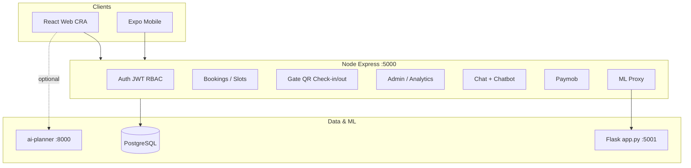

# ParkGo — Project Summary

ParkGo is a **parking management platform** for booking, paying, checking in/out via QR codes, and operating a smart parking lot. It targets **Alexandria National University** (24-slot grid `A1`–`D6`) and supports **customers**, **gatekeepers**, and **admins**.

The repo is a **monorepo** with three client surfaces and one primary API:

| Layer | Tech | Default URL / path |
|-------|------|-------------------|
| Web frontend | React 18 (CRA) | `http://localhost:3001` |
| Mobile app | React Native (Expo) | `mobile-app/` |
| Backend API | Node.js + Express 5 | `http://localhost:5000` |
| Database | PostgreSQL | `parkgo_db` |
| ML demand (optional) | Flask (`app.py`) | `http://localhost:5001` |
| AI layout planner (optional) | FastAPI (`ai-planner/`) | `http://localhost:8000` |

---

## 1. Repository layout

```
ParkGo/
├── backend/                 # Express API server (main business logic)
├── src/                     # React web app (Create React App)
├── mobile-app/              # Expo React Native app (primary mobile client)
├── ParkGoApp/               # Legacy/duplicate mobile tree (older copy)
├── public/                  # Static assets for CRA
├── deploy/                  # Nginx, HTTPS, production guides
├── ai-planner/              # Optional Python service — bay count from lot photo
├── app.py                   # Flask ML: demand forecast + intrusion detection
├── train_model.py           # Demand model training / inference helpers
├── intrusion_detection.py   # Intrusion detection logic (used by Flask)
├── scripts/                 # Data engineering for ML pipeline
├── package.json             # Web frontend dependencies + proxy to :5000
└── README.md                # Local run instructions
```

### Backend (`backend/`)

| Path | Purpose |
|------|---------|
| `server.js` | Main Express app — routes, booking, gate, admin, incidents, ML proxies |
| `routes/authRoutes.js` | JWT auth: signup, login, refresh, logout, `/auth/me`, Google |
| `routes/chat.routes.js` | Authenticated chat: history, active bookings, cancel via chat |
| `routes/chatbot.routes.js` | Public/optional-auth chatbot endpoint |
| `middleware/auth.js` | Re-exports RBAC guards |
| `middleware/rateLimits.js` | Rate limits for login, booking, QR, chatbot |
| `middleware/optionalAuth.js` | Soft JWT for anonymous chatbot users |
| `rbac.js` | Role-based access: `user`, `admin`, `gatekeeper` |
| `authTokens.js` | JWT access/refresh token issue and verify |
| `controllers/authController.js` | Auth handler implementations |
| `smartParking.js` | Peak pricing, availability, slot recommendations |
| `parkingPricing.js` | Tiered tariff: first hour + extra per hour (EGP) |
| `qrJwt.js` | Booking QR JWT sign/verify, expiry |
| `paymobRoutes.js` | Paymob Visa/Mastercard payment integration |
| `auditLog.js` | Audit trail to `logs` table |
| `ensureAuthSchema.js` | Runtime DB schema alignment for auth (UUID users) |
| `services/chatbot.service.js` | Intent parsing, booking actions, demand guidance |
| `services/bookingChat.service.js` | Chat-driven cancel / list bookings |
| `services/chatMessages.schema.js` | Persist chat messages per user |
| `utils/intentParser.js` | NLP-style intent extraction from user messages |
| `scripts/init-db.sql` | PostgreSQL schema + 24 seed slots |
| `scripts/e2e-local-audit.js` | Smoke test against running API |

### Web frontend (`src/`)

| Path | Purpose |
|------|---------|
| `App.js` | Router, role-protected routes, global Chatbot |
| `context/AuthContext.js` | Session, login/signup/Google, token refresh |
| `context/NotifierContext.js` | Toasts and confirm dialogs |
| `api/` | Modular API layer: `authApi`, `bookingApi`, `chatApi`, `slotApi`, `adminApi`, `paymentApi`, `gateApi`, `incidentApi` |
| `api/client.js` | Central `apiRequest()` with auth headers |
| `config/apiOrigin.js`, `apiBase.js` | `REACT_APP_API_BASE_URL` resolution |
| `pages/` | Screens per role and flow (see §4) |
| `components/` | Navbar, Chatbot, slot grid, demand forecast, protected route |
| `services/chat.service.js`, `chatbot.service.js` | Chat UI integration |
| `setupProxy.js` | Dev proxy tweaks (forecast → Express) |

### Mobile app (`mobile-app/`)

| Path | Purpose |
|------|---------|
| `App.js` | Entry, AuthProvider, RootNavigator |
| `navigation/RootNavigator.js` | Auth vs role-based tabs (user / gatekeeper / admin) |
| `navigation/tabs/` | `UserTabs`, `GatekeeperTabs`, `AdminTabs` |
| `screens/` | Login, register, welcome, booking, QR, gate scanner |
| `store/AuthContext.js` | Mobile session (AsyncStorage) |
| `services/apiClient.js` | HTTP client to backend |
| `components/` | SlotGrid, Chatbot, AlexandriaParkingGrid, etc. |

---

## 2. System architecture



### Request flow (typical booking)

1. User logs in → `POST /auth/login` → access JWT stored client-side.
2. Dashboard loads slots → `GET /slots` → slot states from `parking_slots`.
3. User picks slot + time → `POST /reservations` (rate-limited).
4. Server runs transaction: lock slot (`FOR UPDATE`), insert reservation, set slot `state = 2` (reserved), compute price, issue QR JWT.
5. User pays (optional) via Paymob routes or proceeds with chosen `paymentMethod`.
6. Gatekeeper scans QR → `POST /gate/qr/preview` → `POST /gate/check-in` or `check-out`.
7. Slot state transitions: `0` free → `2` reserved → `1` occupied → `0` free on checkout/cancel.

### Authentication & authorization

- **JWT Bearer tokens** on protected routes (`Authorization: Bearer <token>`).
- **Roles** stored on `users.role` and embedded in JWT:
  - `user` — book, pay, incidents, chat
  - `admin` — user management, slots, analytics, logs (also allowed on customer APIs)
  - `gatekeeper` — QR scan, check-in/out, gatekeeper incidents
- **Password login lockout**: 4 failed attempts → 5-minute block (in-memory on server).
- **Google OAuth** optional via `REACT_APP_GOOGLE_CLIENT_ID` (web) and `POST /auth/google`.

---

## 3. Database model

Defined in `backend/scripts/init-db.sql` and extended at runtime in `server.js` / `ensureAuthSchema.js`.

### Core tables

| Table | Key fields | Notes |
|-------|------------|-------|
| `users` | `id`, `username`, `email`, `password_hash`, `role` | May use UUID in production schema |
| `parking_slots` | `slot_no` (PK), `state` | Seeded `A1`–`D6` |
| `reservations` | `user_id`, `slot_no`, `start_time`, `end_time`, `status`, `total_amount`, `qr_token`, `check_in_time`, `check_out_time`, `dynamic_hourly_rate`, `late_fee_*` | Status enum below |
| `incident_reports` | reporter info, `photo_filename`, `reporter_type` | User or gatekeeper |
| `logs` | `user_id`, `action`, `timestamp`, `ip_address` | Audit trail |

### Slot states (`parking_slots.state`)

| Value | Meaning |
|-------|---------|
| `0` | Available (free) |
| `1` | Occupied (vehicle checked in) |
| `2` | Reserved (booking confirmed, not yet checked in) |

### Reservation statuses

`confirmed` → `checked_in` → `closed`

Also: `cancelled`, `no_show`

- **No-show sweep**: If status is `confirmed` and current time is past `start_time + ARRIVAL_WINDOW_MINUTES` (default 20) without check-in, reservation is cancelled and slot freed.

---

## 4. Web app routes & features

| Route | Access | Feature |
|-------|--------|---------|
| `/` | Public | Welcome / marketing |
| `/book-parking` | Public | Leaflet map booking entry |
| `/book-parking/alexandria-national-university` | Public | Interactive slot grid |
| `/lot-designer` | Public | Smart layout designer (3D / planner UI) |
| `/login`, `/signup` | Public | Auth (+ `/login/admin` variant) |
| `/payment`, `/payment/return` | User | Paymob checkout flow |
| `/user/*` | User | Dashboard: book, QR, history, demand assistant |
| `/user/report-incident` | User | Incident report with photo upload |
| `/gatekeeper/*` | Gatekeeper | QR scanner, check-in/out, booking lookup |
| `/gatekeeper/report-incident` | Gatekeeper | Gate-side incident report |
| `/admin/*` | Admin | Users, reservations, slots, analytics, incidents, logs |

Global **Chatbot** widget on all pages (`src/components/Chatbot.jsx`).

---

## 5. Backend API surface (Express)

### Health & info

- `GET /` — API index
- `GET /health` — DB connectivity check

### Auth (`routes/authRoutes.js`)

- `POST /auth/signup`, `/auth/register`, `/auth/login`, `/auth/refresh`, `/auth/logout`, `GET /auth/me`, `POST /auth/google`
- Legacy duplicates in `server.js`: `POST /auth/signup`, `/auth/login`, `/auth/google` (older inline handlers)

### Parking & bookings

- `GET /slots` — All slots with state
- `POST /reservations` — Create booking (optional `slotNo`)
- `GET /reservations/user/:userId` — User's bookings (owner only)
- `PATCH /reservations/:id/cancel` — Cancel booking, free slot
- `POST /reservations/:id/overstay-extend` — Extend past scheduled end

### Smart parking & ML proxies

- `GET /api/parking/recommendations`, `/api/smart-recommendations` — Ranked slot suggestions
- `POST /api/predict-demand` → Flask `/predict`
- `GET /api/forecast` → Flask `/forecast` (6-hour demand)
- `POST /api/intrusion-detect` → Flask `/intrusion/detect`

### Gate operations

- `POST /gate/qr/preview` — Validate scanned QR JWT
- `GET /gate/booking/:bookingId` — Legacy ID lookup
- `POST /gate/check-in` — `confirmed` → `checked_in`, slot → occupied
- `POST /gate/check-out` — `checked_in` → `closed`, compute late fees, slot → free

### Incidents

- `POST /incidents` — User report (multipart photo)
- `POST /incidents/gatekeeper` — Gatekeeper report
- Static files: `/uploads/incidents/*`

### Admin (require `admin` role)

- Users: list, create, patch, delete, history
- `GET /admin/reservations`, `/admin/logs`, `/admin/incidents`, `/admin/analytics`
- `GET /admin/security-alerts`
- Slots: `POST /admin/slots`, `PATCH /admin/slots/:slotNo`

### Chat

- `GET /api/chat/history`, `/api/chat/bookings/active`
- `PATCH /api/chat/bookings/:id/cancel`, `/api/chat/bookings/cancel-all`
- `POST /api/chat/message` — Authenticated assistant
- `POST /api/chatbot/message` — Public/optional-auth bot

### Payments

- Paymob routes registered from `paymobRoutes.js` (config + checkout callbacks)

---

## 6. Core business logic

### Pricing (`parkingPricing.js` + `smartParking.js`)

- **Tiered tariff**: first billed hour = `PARKING_FIRST_HOUR_EGP` (default 20 EGP), each extra hour = `PARKING_EXTRA_PER_HOUR_EGP` (default 5 EGP).
- Billing uses **whole hours rounded up** (minimum 1 hour).
- **Peak detection** uses `Africa/Cairo` timezone (rush hour, lunch, weekend windows) → adjusts dynamic quote via `computeQuote()`.
- **Availability factor**: higher occupancy → slightly higher dynamic rate.

### Booking creation (`POST /reservations`)

1. Validate times and compute `serverTotalAmount` from tiered pricing + peak at start.
2. `BEGIN` transaction, sweep no-shows.
3. Lock requested slot or first available (`state = 0`).
4. Insert reservation with `status = 'confirmed'`, `qr_token` (JTI), `qr_expires_at`.
5. Update slot to `state = 2`.
6. Return reservation + `qrJwt` for display/scan.

### Check-in rules

- Only from `confirmed`.
- Allowed window: `start_time - EARLY_CHECKIN_MINUTES` (default 60) through `start_time + ARRIVAL_WINDOW_MINUTES` (default 20).
- Sets `checked_in`, records `check_in_time`, slot `state = 1`.

### Check-out & overstay

- Only from `checked_in`.
- `computeCheckoutAmounts()`:
  - **Base**: tiered pricing from check-in to `min(checkout, scheduled end)`.
  - **Late fee**: per hour after scheduled `end_time` × `dynamic_hourly_rate` or `OVERSTAY_HOURLY_RATE`.
- Sets `closed`, frees slot (`state = 0`).

### QR security (`qrJwt.js`)

- JWT embeds `bookingId`, `userId`, `jti`; verified on gate scan.
- Revocation: `qr_token` in DB must match JWT `jti` (prevents reuse after checkout).
- Expiry tied to reservation `end_time` / `qr_expires_at`.

### Chatbot (`services/chatbot.service.js`)

- **Intent parser** (`utils/intentParser.js`): check parking, my bookings, cancel, book now, help, etc.
- Can call internal API (`CHATBOT_INTERNAL_API_URL`) for slots, forecast, and booking actions.
- Supports multi-step cancel confirmation and booking window construction.
- Persists messages via `chat_messages` table for logged-in users.

---

## 7. Mobile app architecture

- **Expo** project in `mobile-app/` (run via `npm run mobile` from repo root).
- **Navigation**: unauthenticated → `AuthStack`; authenticated → role tabs.
- **Parity with web**: slot grid, booking, QR display, gatekeeper scanner, admin dashboard, chatbot.
- **Config**: `mobile-app/src/utils/config.js` — API base URL from env / `app.config.js`.
- **Storage**: `tokenStorage.js`, `bookingStorage.js`, `chatbotStorage.js` for offline/session data.

---

## 8. Optional services

### Flask demand ML (`app.py`, port 5001)

- Loads `demand_model.pkl` from `train_model.py`.
- Endpoints: `/predict`, `/forecast`, `/intrusion/detect`, `/health`.
- Express proxies these so the frontend only talks to port **5000**.

### AI layout planner (`ai-planner/`, port 8000)

- FastAPI + uvicorn; estimates bay counts from aerial lot photos.
- Web route `/lot-designer` can call `REACT_APP_AI_PLANNER_URL`.

---

## 9. Configuration & environment

| Variable | Where | Purpose |
|----------|-------|---------|
| `DATABASE_URL` | `backend/.env` | PostgreSQL connection |
| `JWT_ACCESS_SECRET` | `backend/.env` | Sign access tokens |
| `PORT` | `backend/.env` | API port (default 5000) |
| `CORS_ORIGIN` | `backend/.env` | Production allowed origins |
| `REACT_APP_API_BASE_URL` | root `.env` | Web API host (build + runtime) |
| `REACT_APP_GOOGLE_CLIENT_ID` | root `.env` | Google sign-in |
| `FLASK_DEMAND_URL` | `backend/.env` | ML service URL |
| `PARKING_FIRST_HOUR_EGP` | `backend/.env` | Pricing |
| `ARRIVAL_WINDOW_MINUTES` | `backend/.env` | No-show window |

Development: CRA `package.json` `"proxy": "http://127.0.0.1:5000"` forwards `/api/*` to Express.

---

## 10. Deployment

- **`deploy/DEPLOYMENT.md`**: Nginx serves React `build/`, proxies API to Express on same domain.
- **`deploy/nginx/parkgo.conf`**: Sample reverse proxy config.
- **`deploy/ENABLE-HTTPS.md`**: Certbot TLS setup.
- Production: `REACT_APP_API_BASE_URL=https://your-domain.com`, `NODE_ENV=production`, `TRUST_PROXY=1`.

---

## 11. How to run locally (quick reference)

```bash
# 1. Database
psql -U postgres -d parkgo_db -f backend/scripts/init-db.sql

# 2. Backend
cd backend && npm install && npm start

# 3. Web frontend (new terminal, repo root)
npm install && npm start

# 4. Optional: Flask ML (new terminal, repo root)
python app.py

# 5. Optional: Mobile
cd mobile-app && npx expo start -c
```

Smoke test: `cd backend && node scripts/e2e-local-audit.js`

---

## 12. Key design decisions

1. **Single source of truth**: PostgreSQL holds slots, reservations, and audit data; slot `state` is updated in the same transactions as booking/gate actions.
2. **Server-side pricing**: Totals are computed on the server at booking and checkout — clients display estimates only.
3. **Role separation**: Gate APIs are intentionally separate from customer JWT paths; gatekeeper role cannot access user payment flows.
4. **Progressive enhancement**: ML forecast, Paymob, Google OAuth, and AI planner are optional — core booking works without them.
5. **Monorepo clients**: Web and mobile share the same REST API; web uses `src/api/*`, mobile uses `services/apiClient.js`.

---

*Generated from the ParkGo codebase structure and `backend/server.js` as the primary logic reference.*
